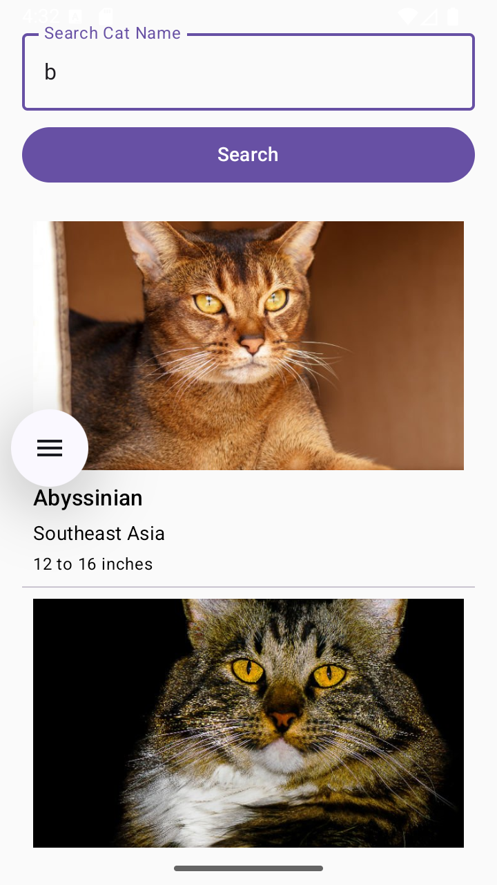
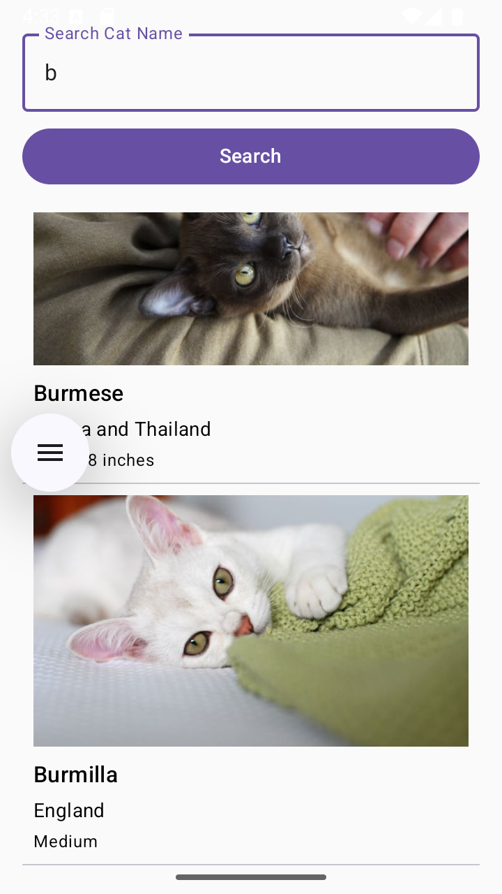

# Jetpack Compose Retrofit Cats App

This Android application demonstrates how to build a simple app using modern Android development tools and practices. It fetches a  
list of cat breeds from an external API (likely [TheCatAPI](https://api-ninjas.com/api/cats) or a similar service) and displays them in a list using Jetpack Compose. The app showcases the use of Retrofit for networking, Hilt for dependency injection, and Coil for image loading.

## Screenshots
| Screenshot 1                  | Screenshot 2                  |
|-------------------------------|-------------------------------|
|  |  |

## Features
*   **View a list of cat breeds:** Fetches data from a remote API.
*   **Search for cat breeds:** Allows users to filter the list based on breed name.
*   **Display cat images:** Loads and shows images of cats using Coil.
*   **Modern UI:** Built entirely with Jetpack Compose.
*   **Clean Architecture (simplified):** Demonstrates separation of concerns with UI, ViewModel, Repository, and Data layers.
*   **Dependency Injection:** Uses Hilt for managing dependencies.
*   **Error Handling:** Basic error display for network issues.
* ** Loading States:** Shows a progress indicator while data is being fetched.

## Technologies Used

*   **[Kotlin](https://kotlinlang.org/)**: Primary programming language.
*   **[Jetpack Compose](https://developer.android.com/jetpack/compose)**: Modern toolkit for building native Android UI.
*   **[Retrofit](https://square.github.io/retrofit/)**: Type-safe HTTP client for Android and Java.
*   **[Gson](https://github.com/google/gson)**: For JSON serialization/deserialization.
*   **[Hilt](https://dagger.dev/hilt/)**: Dependency injection library for Android.
*   **[Coil](https://coil-kt.github.io/coil/)**: Image loading library for Android backed by Kotlin Coroutines.
*   **[Kotlin Coroutines](https://kotlinlang.org/docs/coroutines-overview.html)**: For asynchronous programming.
*   **[ViewModel](https://developer.android.com/topic/libraries/architecture/viewmodel)**: To store and manage UI-related data in a lifecycle-conscious way.
*   **[LiveData/StateFlow](https://developer.android.com/kotlin/flow/stateflow-and-sharedflow)**: (Likely using `State` with Compose) For observing data changes.
*   **[OkHttp](https://square.github.io/okhttp/)**: (Used by Retrofit) Efficient HTTP client.
*   **HttpLoggingInterceptor**: For debugging network requests.
*   **Android Jetpack Libraries**

## Project Structure (Simplified)

The project follows a basic layered architecture:

*   **`app/src/main/java/com/example/jetpackcomposeretrofit`**:
*   **`data`**:
   *   **`model`**: Contains data classes (e.g., `Cat.kt`) representing the structure of the API response.
   *   **`remote`**:  
       *   **`ApiService.kt`**: Retrofit interface defining API endpoints.  
       *   **`CatRepositoryImpl.kt`**: Implementation of the `CatRepository` interface, responsible for fetching data from the API.
   *   **`di`**: Hilt modules for providing dependencies (e.g., `AppModule.kt` for Retrofit, Repository instances).
*   **`domain`**:
   *   **`repo`**:  
       *   **`CatRepository.kt`**: Interface defining the contract for data operations related to cats.
*   **`presentation`**:
   *   **`cat`**:  
       *   **`CatScreen.kt`**: Composable function for the main screen displaying the cat list and search functionality.  
       *   **`CatList.kt`**: Composable for displaying the `LazyColumn` of cats.  
       *   **`CatItem.kt`**: Composable for displaying a single cat item in the list.  
       *   **`CatViewModel.kt`**: ViewModel responsible for fetching and managing UI-related cat data.
*   **`util`**:
   *   **`ApiState.kt`**: Sealed class/interface to represent different states of an API call (Loading, Success, Error).
   *   **`constants`**:  
       *   **`Constants.kt`**: For storing base URLs, API keys (loaded from `BuildConfig`).
*   **`MyApplication.kt`**: Application class, annotated with `@HiltAndroidApp`.

## Setup and  Configuration

1.  Clone the repository.
2.   **API Key:**  This project requires an API key to fetch data.
* Create a file named `apikeys.properties` in the **root** directory of the project (same level as `settings.gradle.kts`).
* Add your API key to this file: *   **Important:** The `apikeys.properties` file should be added to your `.gitignore` to prevent your API key from being committed to version control.
3.  **Build and Run:**
* Open the project in Android Studio.
* Let Gradle sync and download dependencies.
* Run the app on an emulator or a physical device.

## Key Learning Points from the Project

*   Setting up Retrofit for API calls.
*   Using Gson for JSON parsing.
*   Implementing Hilt for dependency injection.
* Creating Hilt modules (`@Module`, `@InstallIn`).
* Injecting dependencies into ViewModels (`@HiltViewModel`, `@Inject`).
* Binding interfaces to implementations (`@Binds`).
* Providing instances with custom logic (`@Provides`).
*   Building UIs with Jetpack Compose.
* Using `LazyColumn` for efficient list display.
* State management in Compose (`remember`, `mutableStateOf`, `State`).
* Handling user input (e.g., `OutlinedTextField`, `Button`).
*  Loading images from URLs using Coil's `AsyncImage` composable.
*   Managing asynchronous operations with Kotlin Coroutines and `viewModelScope`.
*   Basic error handling and displaying loading states.
*   Accessing `BuildConfig` fields from Gradle properties.
*   Structuring an Android application with a layered architecture.

## Potential Improvements

*   **More Robust Error Handling:** Display more user-friendly error messages, implement retry mechanisms.
*   **Pagination/Infinite Scrolling:** For APIs that return large datasets.
*   **Caching:** Implement caching strategies to reduce network calls and improve offline experience (Retrofit/OkHttp caching or a local database like Room).
*    **Unit and UI Tests:** Add tests to ensure code quality and reliability.
*   **Navigation:** If the app grows to multiple screens, implement Jetpack Navigation Compose.
*   **Detail Screen:** Navigate to a detail screen when a cat item is clicked to show more information.
*   **UI Enhancements:** Improve the visual design and user experience.
*   **Flow for API calls:** Use Kotlin Flow in the repository and ViewModel for more advanced stream processing.  
  